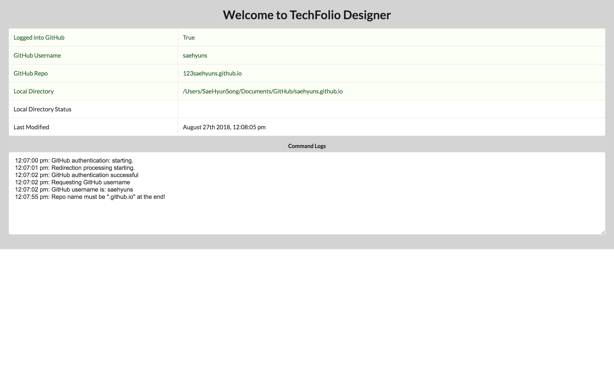

# 1. Change background color of Splash Page

## Requirements:
Change the background color of the splash page to light grey.

### Files changed:

```

In ../splash/SplashPage.html

Before:
<div id="SplashPage"></div>

After:
<div style="background-color: lightgrey" id="SplashPage"></div>

```

In order to change the background of the splash page to light grey, all I had to do was set the background-color style in the SplashPage.html file to lightgrey. A really simple CSS change.

### System:
I was able to learn that you can directly use HTML / CSS elements in Electron just like a web application.

### Problems:
No problems were encountered..

### Result:
<kbd>  </kbd>

# 2. Add "last modified" Timestamp to Splash Page

## Requirements:
Add a new row to the Splash page called "Last Modified" whose value is a nicely formatted timestamp (using Momentjs). Whenever something changes in the Splash page (i.e. a value changes in the table, or new text is printed to the Command Logs, the value of the timestamp should be updated to reflect that change.

### Files changed:

```

../splash/SplashTable.jsx

```

In order to add a "last modified" timestamp to the Splash page, all I had to do was add more properties to the objects that were intially created. I added a timestamp property containing the current Date / Time using Moment.js. In order to use Moment.js I had to include it in the beginning. After adding the property to the respective object, I then added an extra row to the Table which returned the "Last Modified" portion as well as the current Date / Time whenever a change occurred.

### System:
I learned how to add new rows to a table that is part of a Reach component as well as learned how to include moment.js in order to use it.

### Problems:
A problem that occurred was trying to figure out how I can return the current time. I figured it out by reading the moment.js documentation and figuring out to how to include it as well as it's other properties and methods to format it nicely.

### Result:
<kbd>  </kbd>

<kbd>  </kbd>

<kbd>  </kbd>

# 3. Add Menu Item to Config Menu

## Requirements:
Add a menu item called "Get Current Time" to the Config menu. When this menu item is selected, a notification window is created with text indicating the current time.

### Files changed:

```

../main/ConfigSubMenu.js
../main/Git.js

```

I modified the ConfigSubMenu.js and Git.js in order to add a menu item called "Get Current Time". Where I created a function in ConfigSubMenu that called a function in Git.js to run the program. That seemed to be the general process from the context of the code for the other functions. There were functions imported from the Git.js file that provided the functionality of the menu items in ConfigSubMenu.js. In order to create a notification, I used a node module that was already installed called node-notifier which created a Desktop Notification of the current time when request by the use in the menu.

### System:
I learned how to utilize the the node-notifier module provided in order to create a desktop notification containing the current time as well as linking the functionality of menu items.

### Problems:
I had a problem of trying to figure out how to get desktop notifications working. This particular subject was something I was not familiar with so it ended up taking me the most time compared to the other enhancements. But I've solved it by investigating what tools were provided to me in the node_modules directory.


### Result:
<kbd>  </kbd>

<kbd>  </kbd>

# 4. Add Simple Validation to Set GitHub Repo Name

## Requirements:
When specifying the TechFolio repo using "Set Github Repo name" check to make sure the provided text string ends with ".github.io". If it doesn't, signal an error and do not set the repo name.

### Files changed:

```

../main/ConfigSubMenu.js

```

In order to make sure that the github repo name ends with .github.io I accessed the setRemoteRepo() function located in the ConfigSubMenu.js file. Where I simply added a conditional statement to check that the repoName string contains '.github.io' at the end of it. The conditional consisted of using the endsWith() method provided by Javascript to check that it ended with .github.io

### System:
I learned how to signal an error by using action.addLog() printing to the command line provided on the bottom of the UI.

### Problems:
The problem I had with this initially was when I used the includes() method, it would allow any string that contained '.github.io' not ended with it. So I had a problem when I typed '.github.io.hello', it would set the repo name which is invalid. So I figured out a method caled endsWith() to solve this problem so that there can't be any other characters following '.github.io'.

### Result:

<kbd>  </kbd>

<kbd>  </kbd>

<kbd>  </kbd>

<kbd>  </kbd>

<kbd>  </kbd>

# 5. Allow Four Networks in the Simple Bio Editor

## Requirements:
The current Simple Bio Editor only allows three Networks. Enhance it to allow four networks.

### Files changed:

```

../simplebioeditor/SimpleBioEditorTabNetwork.jsx

```

All I modified for this was just adding more fields on top of the existing ones. Such as this.state.model.urlN, const entryN, where N = 4 in our case as we are adding a fourth network. On top of that, it consisted on adding Grid.column and Autofield elements.

### System:
I learned how to add more fields into an existing form.

### Problems:
I had no problems with this. However, I've noticed that one slight improvement we could do is create a loop instead of manually writing the code for each network. Just in case someone had some decently large number of N networks. Maybe the user can specify an N number of networks and we can create the N number of fields for the form the user can fill out.

### Result:

<kbd>  </kbd>

<kbd>  </kbd>

<kbd>  </kbd>

# 6. Perform Simple Validation on Project and Essay Files

## Requirements:
When the user attempts to save a Project or Essay, check to see that the "date:" field is in YYYY-MM-DD format. If not, save the file but also provide a notification that the date field was not valid.

### Files changed:

```

../techfolioeditor/TechFolioEditor.jsx

```

I initally looked for a function where it saves the file whenever a command + s button is pressed. After finding it, I modified it by having it read in the contents of the file, remove all lines but the ones containing "date" or "Date". Then I called a .match method to a regexp /(\d{4})-(\d{2})-(\d{2})/ where it checks to see that it contains 4 digits followed by a - then 2 digits followed by a - then two more digits. If it isn't in that format, it would notify the user by using the node-notifier module and would save the file as usual.

### System:
I learned that I can manipulate the contents of the project or essay from by getting this.state.value which gives me a very long string with new line characters.

### Problems:
The problem I had with this was trying to figure out how to get the string of the essay or the project which was simply done by this.state.value.

### Result:

<kbd>  </kbd>

<kbd>  </kbd>

<kbd>  </kbd>

# Reference:

[Onboard as a TechFolio Developer, Part 2](https://github.com/techfolios/techfoliodesigner/issues/22)
