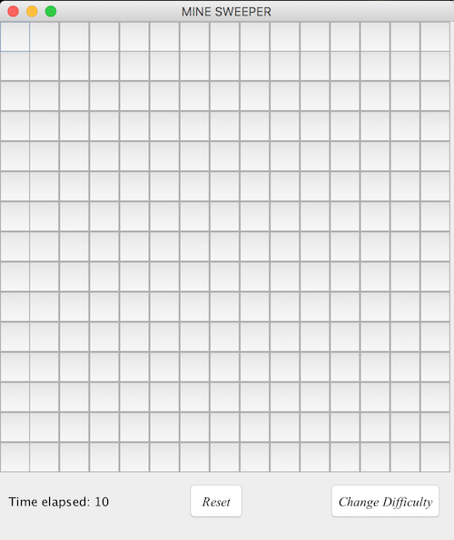

  
  
  
  

Minesweeper is a single player puzzle game which originated from the 1960's. The objective of the game is to clear a rectangular board which has bombs hidden inside each square. Utilizing the number clues given, through probability and logic you try and press on every square possible without detonating a mine. If you do so successfully, you win. The grid sizes and number of bombs depend on the level of difficulty that you would like to play at.

For this project, we didn't really give each other specific roles but instead delegated who would do what in the program. I started by programming the creation of the grid, one of the most important aspects of the game. Without a grid, it wouldn't be a Minesweeper game. From then, I transferred over to the initialization portion of the MineSweeper program which included the difficulty buttons, high score buttons, and the reset buttons. Where the grid size and the number of bombs would change depending on the difficulty selected, and the reset button would reset the entire grid to a new one. At the end of the project, I contributed to the shortening and polishing of the code as well as organizing the commenting.

You can see my source code on GitHub at: <a href="https://github.com/saehyuns/Projects/tree/master/MockMi-Ne%20Sweeper"><i class="large github icon"></i>MockMi-Ne Sweeper</a>

