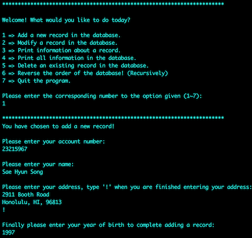
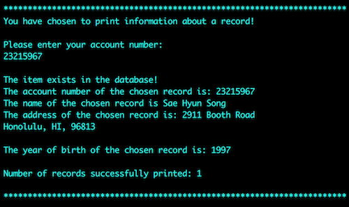
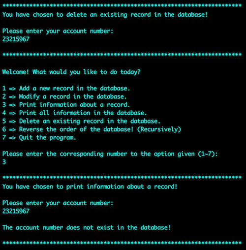

  
  
  

This is a bank database program that of which stored and retrieved data from a text file. You could choose to add a record in which then you would need to input the information for a new record such as name, year of birth, address, etc. The records would be organized as a singly linked list and ordered by the most recent year of birth at the beginning. Modifying a record would require the user to know the account number, if it does exist, it allows the user to change the address if not, it will ask to re-enter the account number. You may also delete/look up records in the same manner, as long as you know the account number associated with the record. 

This bank database program was implemented using vi, terminal, C++, and C. Initially the project was created in C, then we had to reconfigure and change the entire project to C++ code. This project helped me learn and better understand how to use the vi editor as well as design and implement a database program by using C and C++.
 
The source code to my program will be at: <a href="https://github.com/saehyuns/Projects/tree/master/Mock%20Bank"><i class="large github icon"></i>Bank DB Application.</a>
