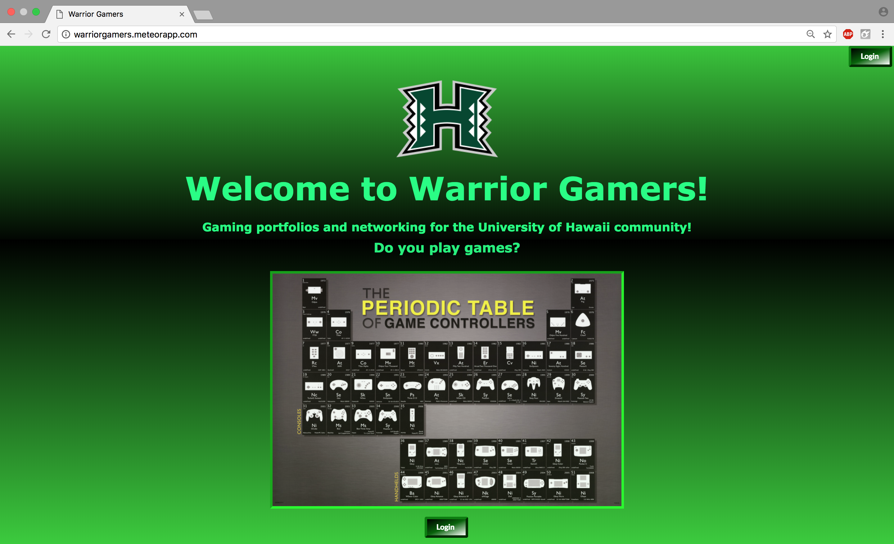
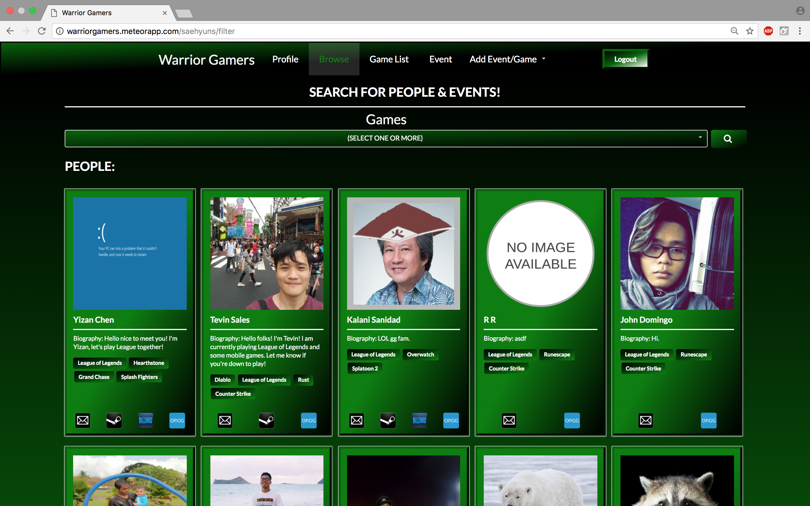
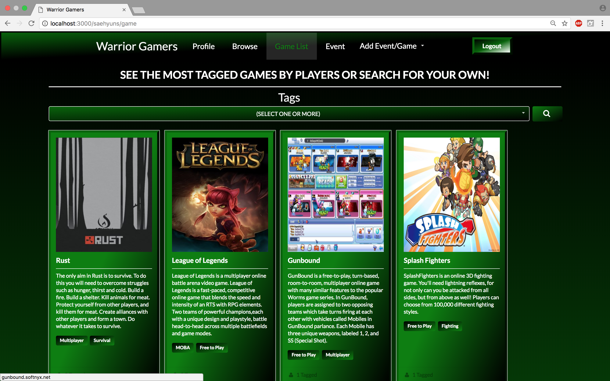
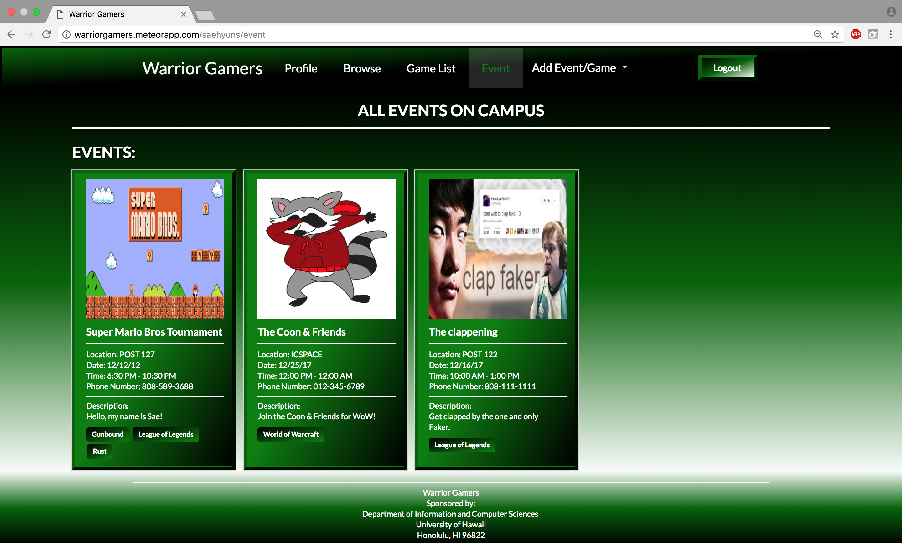

<h1>Overview</h1>
Being a gamer myself, knowing what it feels like to not want to socialize and just play games before. I realized that there are others just like me here at UH. They tend to either play with themselves or just play with their close group of friends. It is hard to find someone else with the same game interest and time to play with each other. Therefore, Warrior Gamers is an application which tries to help bridge the gap between anti-social gamers in order to increase communication and social interaction between each other.

<h2>Landing Page</h2>

This is the Landing Page for the Warrior Gamers app. It contains a brief slideshow of what the application contains.

<h2>Browse Page</h2>

This is the Browse Page of the Warrior Gamers App. It initially contains all the people in the database. You can choose to narrow down your search based off games. It will show all profiles with the related games. It also contains events in which you can search for based off of the game you are interested in.

<h2>Game List Page</h2>

This is the Game List Page of the Warrior Gamers App. It contains the various games that are currently in the database. It contains the game picture, the title of the game, the game description, and tags related to the game. In case you’re curious on what the tags do, you can click on them and it will take you to a google search of that definition. You may also search for certain games with certain tags related to it.

<h2>Event List Page</h2>

This is the Event List Page of the Warrior Gamers App. It contains all the events that are currently happening on campus. It contains the picture, title, information, and description of the event along with game tags related to the event.

<h1>My Contributions</h1>
My Contributions to this project was on generally every aspect of the application. I had worked on the Landing Page, the front-end development as well as the back-end development. I had worked on the interface of the forms, buttons, cards, etc for front-end. For the back end I worked on creating multiple collections in the MongoDB database and connect it to the forms / information that will be shown in profile cards. I had also worked on majority of the Project Home Page to showcase what our application is about and what we had to go through as a team. The link is provided at the botttom of the page. 

<h1>What I Learned</h1>
What I learned from this project was being able to not only work with but also manage a group of four people. Being that I had been the one to take the initiative to set up meeting times and get to know more about my team mates. Dividing and delegating the work based off what their schedule is like, their interests and strengths/weaknesses. I had also learned that everyone works at a different pace than others. I will definitely be able to carry on this experience of working in a group using project management skills learned from this course to my future careers or courses.

For more information, our homepage is located <a href="https://314gb.github.io/">here.</a>
